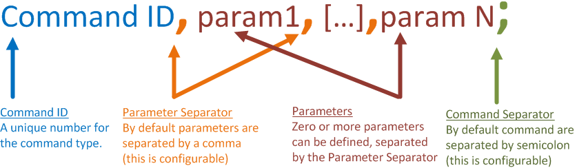

# ftCarControl
Windows client to control the fischertechnik with arduino car

# Introduction
Windows client for remote control of an Arduino including an implementation of CmdMessenger.

# Pre-requisites

https://github.com/inthehand/32feet
https://www.codeproject.com/Articles/842951/CmdMessenger

# Screenshots

# Getting Started

# CmdMessenger
## Protocol

The protocol defined by CmdMessenger is simple and very flexible. The format of the protocol is as follows:

## String Escape parameters
Since the strings could contain a Parameter or Command separator the protocol must support escaping of these special characters. The special characters are escaped by prefixing them with the escape characters. By default the escape characters is a back slash. For example:
- 5,Hello,World; - Would appear as one command with three parameters.
- 5,Hello\\,World; - Would appear as one command with two parameters. 

This is all handled by the library and therefore the client does not need to know these details.

## Architecture
### CmdMessenger

CmdMessenger is the main entry point into the library.
- Start - opens the connection and starts processing incoming commands.
- Stop - closes the connection and stops reading incoming commands.
- Send - Sends an ISendCommand and blocks until a response is received.
- SendAsync - Sends an ISendCommand and returns a Taks<IRecievedCommand>.
- Register - allows a method or ICommandObserver to subscribe to incoming commands with a specified ID.

### IReceivedCommand
IReceivedCommand provides an interface for reading incoming commands.
- ReadInt16 - reads a 16 bit integer from the command.
- ReadBool - reads a boolean from the command where 1, 0 represents true, false respectively.
- ReadInt32 - reads a 32 bit integer from the command.
- ReadString - reads a string from the command.

### ReceivedCommand
ReceivedCommand is the concrete implementation of IReceivedCommand. There shouldn't be a need for clients to implement the interface.

### ISendCommand
ISendCommand provides an interface for sending outgoing commands.

### SendCommand
SendCommand provides a concrete implementation of the the ISendCommand interface. The class can be used by clients directly or the library can be extended by creating command which derive from this class.

### ICmdComms
ICmdComms provides a common interface for transport layers.

### CmdComms
Provides a common implementation for reading commands from a stream. Other stream based transport layers can derive from this base class. Two implementation of the ICmdComms are provided with the library:
- SerialCmdClient
- TcpCmdClient

# License
[The Microsoft Public License (Ms-PL)](http://www.opensource.org/licenses/ms-pl.html)